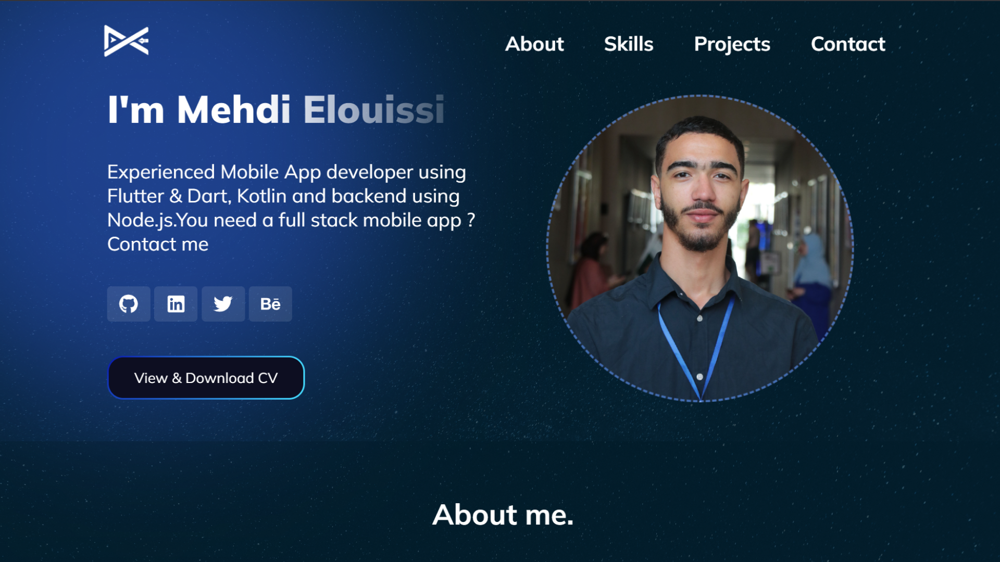
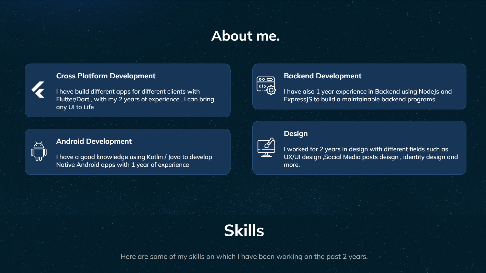
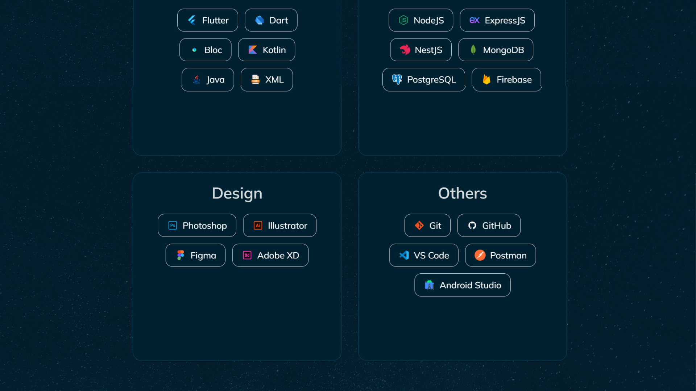
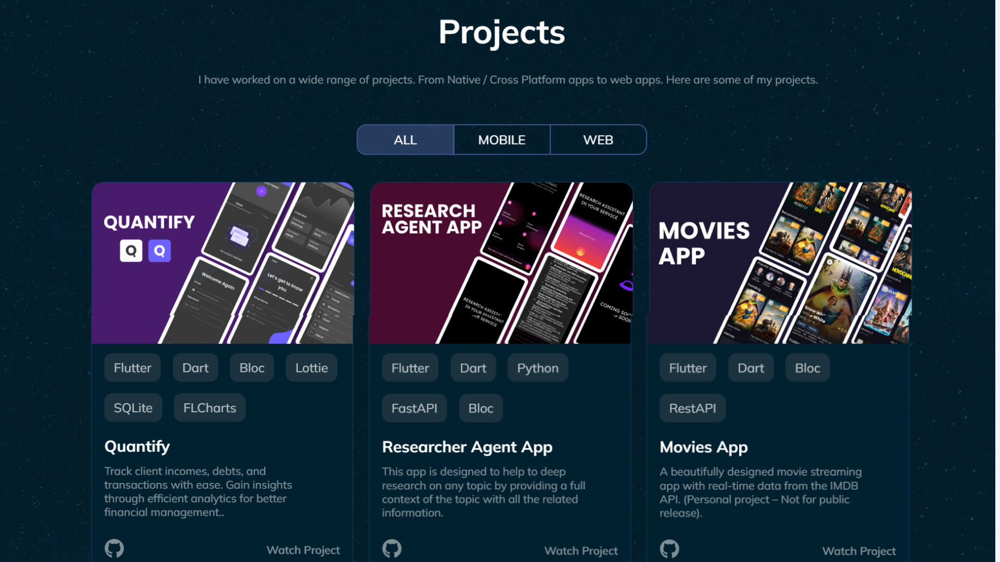
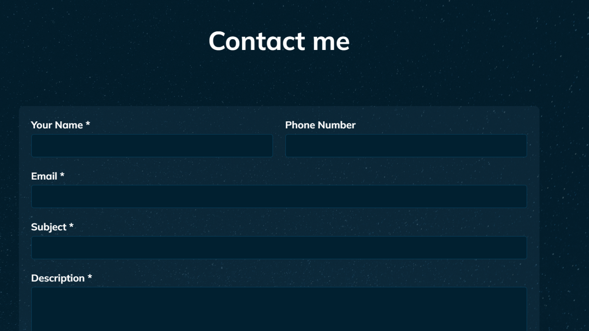

# 👨‍💻 My Portfolio v1 – A Clean & Animated Showcase

Welcome to the repository for the **first version of my personal portfolio**.  
This project is a **fully responsive, single-page application built with React.js** to showcase my skills, projects, and journey as a developer.  

It features a **clean, modern design**, smooth **animations**, and an **intuitive user experience**.

  

<h3 align="center">
  <a href="https://dadixcod.vercel.app"><strong>➡️ View Live Demo</strong></a>
</h3>

---

## ✨ Features

- 🎨 **Sleek & Modern UI** – A clean, minimalist design that puts the focus on the content.  
- 🚀 **Smooth Animations** – Engaging animations on scroll and hover events to create a dynamic and memorable user experience.  
- 📱 **Fully Responsive** – Looks great and functions perfectly on desktops, tablets, and mobile devices.  
- 📂 **Project Showcase** – A dedicated, filterable gallery to display key projects with links and detailed descriptions.  
- 📄 **Interactive Resume** – A timeline-style section for my skills, experience, and education.  
- 📬 **Contact Form** – A simple and effective way for visitors and potential employers to get in touch.  

---

## 📸 Screenshots

Here are some previews of the portfolio in action:

  
  
  
  
  

---

## 🛠️ Tech Stack & Tools

- **Core Framework**: React.js  
- **Styling**: Custom CSS3 & Bootstrap 5  
- **Animations**: CSS Transitions, Keyframes *(and/or libraries like Framer Motion, AOS)*  
- **Deployment**: Vercel  

---

## 🎯 Project Goal

This portfolio was my **first major project built with React.js**, serving as a practical application of my skills in:  

- ⚛️ Component-based architecture  
- 🌀 State management with hooks  
- 📱 Responsive web design  

The primary goal was to create a **digital resume** that is not only informative but also **visually appealing and engaging** for anyone visiting the site.

---

## 📬 Contact Me

💡 Have questions, ideas, or want to collaborate? Reach out to me!  

**Elmehdi Elouissi**  
- [Github](https://github.com/dadixcod)  
- [LinkedIn](https://www.linkedin.com/in/dadixcod)  

---

👨‍💻 Developed with ❤️ using **React.js**
